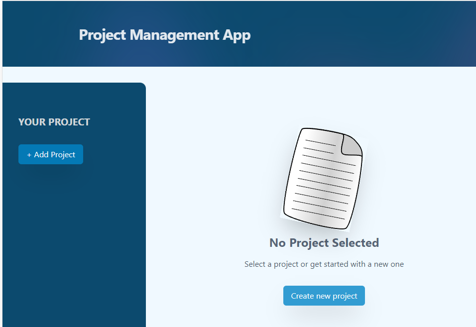
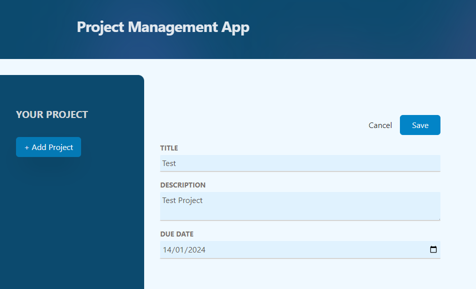

# Project Management Platform

Simple application built with React and Tailwind CSS where a user can create project, view projects and delete them.

# Installation

- to run in locally for education purpose
- download or clone repository
- Node.js is require to run the application
- npm install to install the required packages as per package.json

# live application

[Project Management](https://project-tailwind-two.vercel.app/)

## Home Page

## Project Page

# Features and Technologies uses

- HTML
- React.js
- Tailwind CSS
- Node.js
